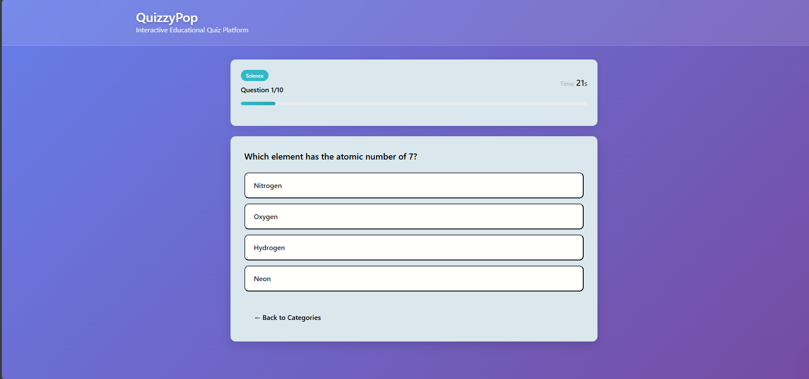
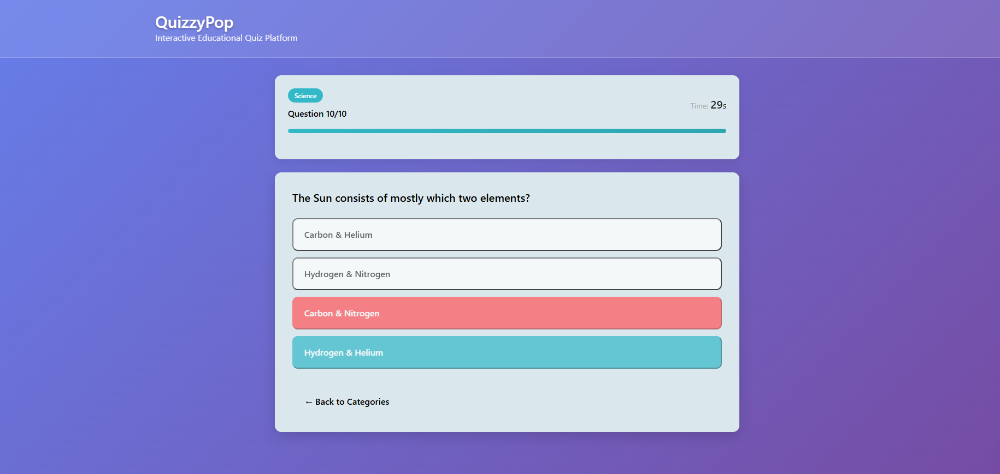
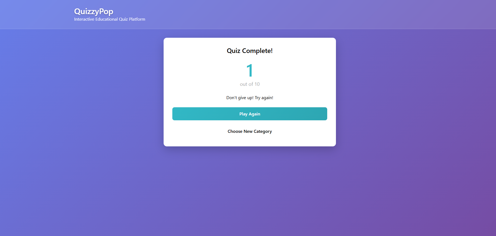

<section id="readme-content">
  <h1>Online Quiz Application</h1>
  
A lightweight, interactive quiz tool built with HTML, CSS, and JavaScript. Designed for students and educators who need a simple, fast, and responsive way to practice and test knowledge. The app features multiple-choice questions, a timer, instant scoring, and immediate feedback to support learning.

  <h2>Table of Contents</h2>
  <ul>
    <li>Project Overview</li>
    <li>Features</li>
    <li>Screenshot</li>
    <li>Getting Started</li>
   
  </ul>

  <section id="project-overview">
    <h2>Project Overview</h2>
    <ul>
      <li>Presents a set of <strong>multiple-choice questions</strong></li>
      <li>Includes a <strong>timer</strong> to pace the quiz</li>
      <li>Calculates and displays <strong>instant scores</strong></li>
      <li>Is easy to integrate into learning workflows for both students and educators</li>
    </ul>
  </section>

  <section id="features">
    <h2>Features</h2>
    <ul>
      <li><strong>Multiple-Choice Questions</strong>: Present a question with several answer options.</li>
      <li><strong>Timer</strong>: Countdown timer to add a sense of urgency and measure pace.</li>
      <li><strong>Instant Scoring</strong>: Score updates as the user answers questions.</li>
      <li><strong> Feedback</strong>:Tells you about your performance.</li>
      <li><strong>Lightweight & Self-Contained</strong>: No dependencies beyond vanilla HTML/CSS/JS.</li>
      <li><strong>Responsive UI</strong>: Works on desktop and mobile devices.</li>
      <li><strong>Extensible</strong>: Simple structure to add more questions or categories.</li>
    </ul>
  </section>

  <section id="Screenshot">
    <h2>Screenshot</h2>
    
    
    
    
  </section>

  <section id="getting-started">
    <h2>Getting Started</h2>
    <h3>Prerequisites</h3>
    <ul>
      <li>Basic knowledge of HTML, CSS, and JavaScript</li>
      <li>A modern web browser (Chrome, Firefox, Edge, or Safari)</li>
    </ul>
  </section>
</section>
